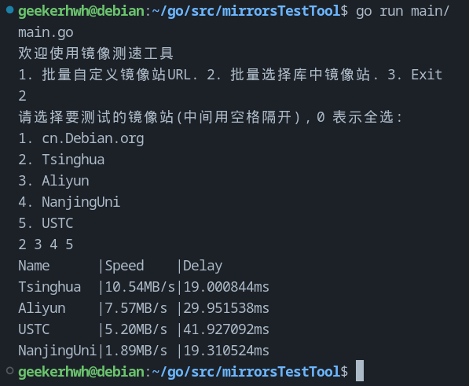

<div align="center">
  <a href="README.md">Click me for English version</a>
</div>
# 测速 Debian/Ubuntu 镜像
该工具主要帮助Debian系用户筛选最佳的apt仓库镜像

如果你有任何的建议或者发现了任何的bug欢迎随时提出issue：）

# 示例


# To Do List
- [x] 解决了contentLength = -1的问题，以防速度为负值
- [x] 输入多个URL以测试速度
- [x] 添加了changeMirror.sh以更改默认支持的镜像
- [x] 模块化了速度测试代码
- [x] 多选镜像以进行测试
- [x] 在main.go中简化了代码以提高可读性
- [x] 编写了中文README.md
- [x] 在多选模式中支持一键多选
- [x] 检查主机系统
- [x] 支持以速度带宽排序显示
- [ ] 支持英文注释
- [ ] 支持英文版本
- [x] 支持更多镜像源(已支持中国10大镜像站)
> 详见 [[Debian中国大陆镜像源]](https://www.debian.org/mirror/list.zh-cn.html)
- [x] 支持多线程测速（查看main/task/tester.go中Test函数）
- [x] 支持延迟测试
- [x] 支持多线程延迟测试
- [ ] 支持基于地域的镜像测试
- [ ] 支持网络延时测试
- [ ] 支持内嵌的换源操作

# 如何使用
## 如何测试镜像速度
1. 确保你的电脑安装有Go的运行环境
```bash
go env
```
2. 下载解压该项目文件后，进入项目文件夹运行下命令
```bash
go run main/main.go
```
3. 跟随app指令交互即可

## 测速后如何更换源
```bash
# running in root is needed
sudo ./changeMirror.sh
```