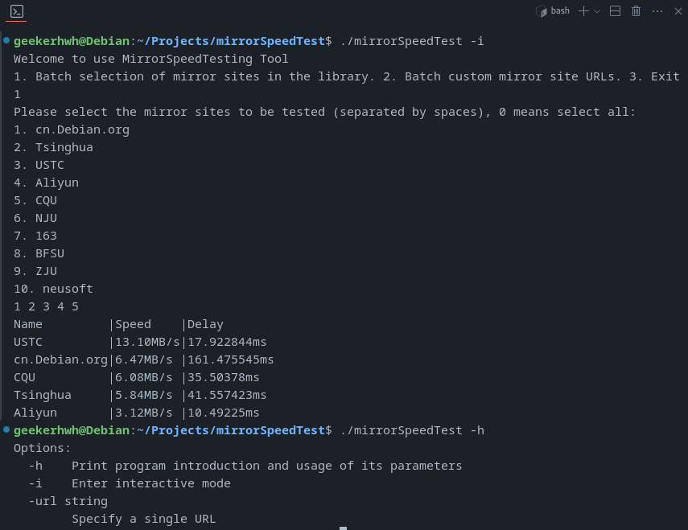

<div align="center">
  <a href="README.md">Click me for English version Doc</a>
</div>

# 测速 Debian/Ubuntu 镜像
该工具主要帮助Debian系用户筛选最佳的apt仓库镜像

软件需求全部基于我个人换源工作流的使用体验，如果你有任何建议对软件使用体验进行改进，欢迎在github上提出issue

# 项目亮点
- 支持用go routine实现的轻量化多线程测速测延迟
- 支持传参和交互两种模式
- 使用Docker对应用进行了容器化便于部署
- 使用Github Actions进行自动化软件测试

# 示例


# 功能
- `-i` 进入交互模式
- `--url` 指定一个镜像地址

# To Do List
- [x] 添加了changeMirror.sh以更改默认支持的镜像
- [x] 多选镜像以进行测试
- [x] 在多选模式中支持一键多选
- [x] 检查主机系统
- [x] 支持以速度带宽排序显示
- [x] 支持更多镜像源(现在支持大多数中国和大多数美国镜像)
> 详见 [[Debian镜像源]](https://www.debian.org/mirror/list.en.html)
- [x] 支持多线程测速（查看main/task/tester.go中Test函数）
- [x] 支持多线程延迟测试
- [ ] 支持在交互模式中选择国家
- [ ] 支持conda和pip的镜像测试
- [ ] 支持基于地域的镜像测试
- [ ] 支持传递参数直接运行
- [x] 应用容器化以迅速使用
- [ ] 支持内嵌的换源操作
- [ ] 使用Github Actions进行自动化软件测试
- [ ] 性能调优
- [ ] 内存使用调优

# 如何使用
## 如何测试镜像速度
### 使用Docker启动
1. 确保你已经安装了docker后执行该命令即可:
```bash
docker run -it geekerhwh/mst:latest
```
### 执行二进制文件
1. 从Release下载mirrorSpeedTest和urls.json(确保在同一文件夹下)
2. 确保二进制文件有权限被执行
```bash
chmod 777 ./mirrorSpeedTest
```
3. 从终端启动即可
```bash
./mirrorSpeedTest
```
### 如果你想用go runtime运行
1. 确保你的电脑安装有Go的运行环境
```bash
go env
```
2. 下载解压该项目文件后，进入项目文件夹运行下命令
```bash
go run main/main.go
```
3. 跟随app指令交互即可

## 测速后如何更换源
```bash
# running in root is needed
sudo ./changeMirror.sh
```