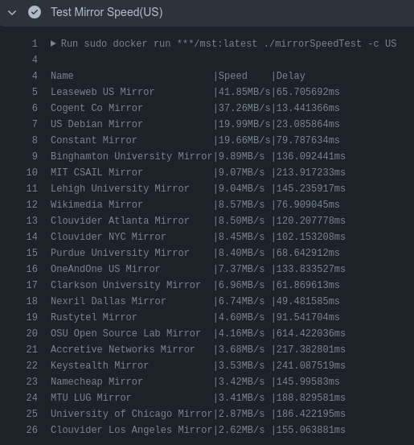

<div align="center">
  <a href="README-ZH.md">For Chinese Doc->中文版说明文档戳这</a>
</div>

# A project for Testing Debian/Ubuntu mirrors
This tool is mainly to help Debian users to select the best apt Repo for themselves,
especially for people who live in China with a special Network Environment, **now it
has supported people all of the world**.

I know there are some netselect tools, but the most important thing when downloading is BANDWITH
The software requirements are all based on my personal experience in the source switching workflow. 
The project is highly experimental, if you have any suggestions for improving the software experience, 
feel free to open an issue or submit a pull request!

If you need support for your country as quick as possible, feel free to email me `hack.huwenhao@gmail.com`
all I wish is your stars. XD

# Project Highlights
- Multi-threads speed(bandwith) and latency testing implemented using go routine
- support both passing parameters and interacting mode
- support different countries in the world
- Docker to contanerize the app for easy deployment
- GitHub Actions to automate testing
- No need for `sudo` if you don't want to change apt source list

# Demo
support mirrors all around the world, CN(local) and US(GithubActions with Docker)
<div style="display: flex; justify-content: space-between;">
    
    
</div>


# Features
- `-i` enter interactive mode
- `--url` specify a single url
- `-c` specify two-letter country abbreviation for your country
  > e.g. `US`for American Mirrors; `CN` for Chinese Mirrors

# How to use it?
## to test mirrors' speeds:
There are 3 ways to run speed testing
### Run with Docker(cmd mode)
- use `--url` to specify a single mirror url
- or use `-c` to choose your country
```bash
sudo docker run geekerhwh/mst:latest ./mirrorSpeedTest -c US
```
### Run with Docker(interactive mode)
1. make sure docker is installed then run:
```bash
sudo docker run geekerhwh/mst:latest ./mirrorSpeedTest -i
```
### or Run with the binary file
1. Download the mirrorSpeedTest and urls.json file(make sure files are in the same directory)
2. make sure the binary file has priviledge to be executed
```bash
chmod 777 ./mirrorSpeedTest
```
3. run it in terminal
```bash
./mirrorSpeedTest
```
### or If you want to run with go runtime
1. make sure your computer has the Go runtime installed
```bash
go env
```
1. enter the directory of this project, then open the terminal to run:
```bash
go run main/main.go
```
1. follow the instruction of the app to get your best mirror(English version 
coming soon)

## to change to the best mirror after Testing(experimental)
```bash
# running in root is needed
sudo ./changeMirror.sh
```

# What's next
- [x] added changeMirror.sh to change the mirror supported by default
- [x] multi choose mirrors to test
- [x] support choose all in multi choice mode
- [x] check whether the host OS is Debian
- [x] support sorting from best to worst
- [x] support worldwide mirrors(almost all debian mirror)
> Check [[Debian Worldwide Mirror Lists]](https://www.debian.org/mirror/list.en.html)
- [x] support multi-threads testing in parallel(check task/tester.go)
- [x] support multi-threads latency testing in parallel
- [ ] support choose country in interactive mode(Now support only CN)
- [ ] support conda and pip mirror testing
- [ ] support geo-based mirrors testing to present perfect suggestion
- [x] support passing parameters for speed testing
- [ ] support passing multi parameters(countries) for Europe user
- [x] containerize the app so that skip install go runtime
- [ ] support integrated apt sourcelist file editting(default choose the fastest)
- [ ] use Github Actions to automate testing
- [ ] tuning the performance
- [ ] tuning the RAM usage
- [ ] beyond my imagination...