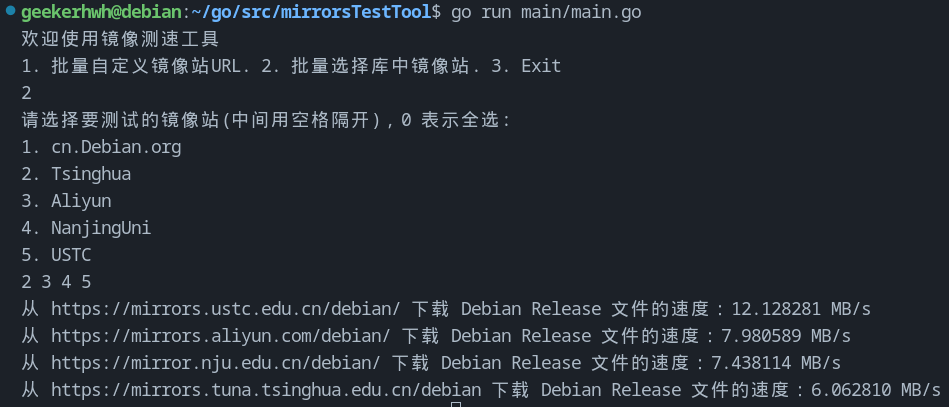

<div align="center">
  <a href="README-ZH.md">中文版说明文档戳这</a>
</div>

# A project for Testing Debian/Ubuntu mirrors
This tool is mainly to help Debian users to filter the best apt Repo for themselves,
especially for people who live in China with a special Network Environment.

**We geekers always want to be the fastest. right?**

If you have any suggestion or bug problem feel free to address an issue:)

# Demo


# What's next
- [x] solved contentLength = -1 problem so that the speed won't be negative
- [x] input multiple URLs to test speeds
- [x] added changeMirror.sh to change the mirror supported by default
- [x] modulize speed test code
- [x] multi choose mirrors to test
- [x] simplized code in main.go for readability
- [x] support choose all in multi choice mode
- [x] write a chinese README.md
- [x] check whether the host OS is Debian
- [ ] support English Comments
- [ ] support English version
- [ ] support more mirrors(5 China Mirrors supported now)
- [x] support multi-threads testing in parallel(check task/tester.go)
- [ ] support geo-based mirrors testing to present perfect suggestion
- [ ] support delay testing
- [ ] support multi-threads delay testing in parallel
- [ ] support integrated apt sourcelist file editting(default choose the fastest)
- [ ] containerize the app so that skip install go runtime
- [ ] beyond my imagination...

# How to use it?
## to test mirrors' speeds:
1. make sure your computer has the Go runtime installed
```bash
go env
```
2. enter the directory of this project, then open the terminal to run:
```bash
go run main/main.go
```
3. follow the instruction of the app to get your best mirror(English version 
coming soon)

## to change to the best mirror after Testing
```bash
# running in root is needed
sudo ./changeMirror.sh
```
