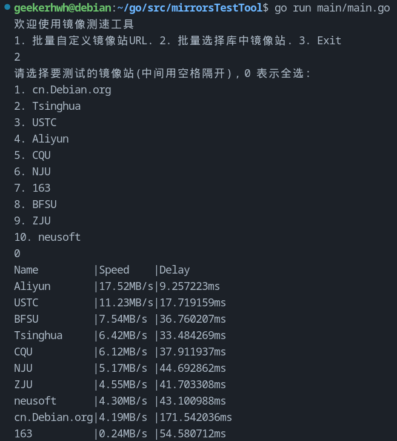

<div align="center">
  <a href="README-ZH.md">For Chinese Doc->中文版说明文档戳这</a>
</div>

# A project for Testing Debian/Ubuntu mirrors
This tool is mainly to help Debian users to filter the best apt Repo for themselves,
especially for people who live in China with a special Network Environment.

The software requirements are all based on my personal experience using the source switching workflow. 
If you have any suggestions for improving the software experience, please feel free to raise an issue on github.

# Project Highlights
- Multi-threads speed and latency testing implemented using go routine
- support both passing parameters and interacting mode
- Docker to contanerize the app for easy deployment
- GitHub Actions to automate testing

# Demo


# What's next
- [x] added changeMirror.sh to change the mirror supported by default
- [x] multi choose mirrors to test
- [x] support choose all in multi choice mode
- [x] check whether the host OS is Debian
- [x] support sorting from best to worst
- [ ] support English Comments
- [ ] support English version
- [x] support more mirrors(10 China Mirrors supported now)
> Check [[Debian Mirror Lists-ZH]](https://www.debian.org/mirror/list.zh-cn.html)
- [x] support multi-threads testing in parallel(check task/tester.go)
- [x] support multi-threads latency testing in parallel
- [ ] tuning the performance
- [ ] tuning the RAM usage
- [ ] support conda and pip mirror testing
- [ ] support geo-based mirrors testing to present perfect suggestion
- [ ] support passing parameters for speed testing
- [x] containerize the app so that skip install go runtime
- [ ] support integrated apt sourcelist file editting(default choose the fastest)
- [ ] use Github Actions to automate testing
- [ ] beyond my imagination...

# How to use it?
## to test mirrors' speeds:
### Run with Docker
1. make sure docker is installed then run:
```bash
docker run -it geekerhwh/mst:latest
```
### or Run with the binary file
1. Download the mirrorSpeedTest and urls.json file(make sure files are in the same directory)
2. make sure the binary file has priviledge to be executed
```bash
chmod 777 ./mirrorSpeedTest
```
3. run it in terminal
```bash
./mirrorSpeedTest
```
### or If you want to run with go runtime
1. make sure your computer has the Go runtime installed
```bash
go env
```
1. enter the directory of this project, then open the terminal to run:
```bash
go run main/main.go
```
1. follow the instruction of the app to get your best mirror(English version 
coming soon)

## to change to the best mirror after Testing
```bash
# running in root is needed
sudo ./changeMirror.sh
```
